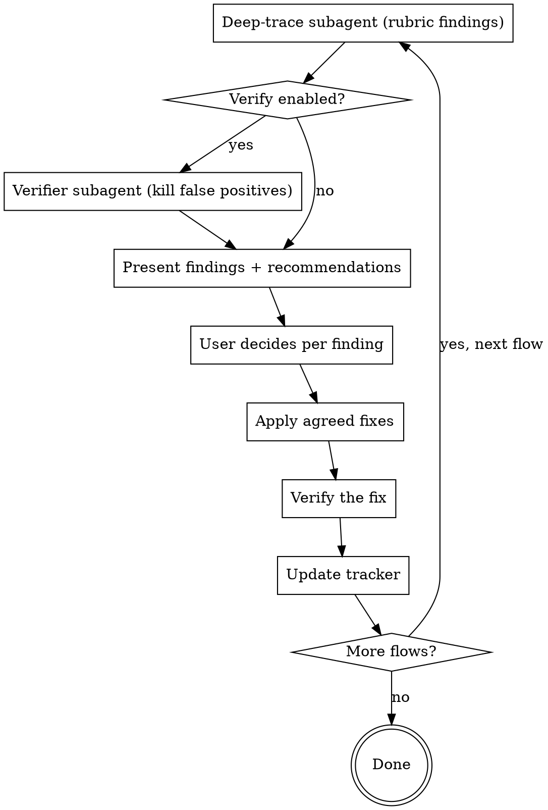

# Pair Vibing Skill Implementation Plan

> **For agentic workers:** REQUIRED SUB-SKILL: Use superpowers:subagent-driven-development (recommended) or superpowers:executing-plans to implement this plan task-by-task. Steps use checkbox (`- [ ]`) syntax for tracking.

**Goal:** Build the `pair-vibing` skill — a subagent-orchestrated skill that pairs the user with the agent to review a project's user flows one at a time, apply agreed fixes, and track progress in a resumable `flows.md`.

**Architecture:** The skill is Markdown: a lean `SKILL.md` driving the process plus three `references/` files (rubric, discovery, tracker template). We build it with TDD-for-skills: a deliberately-broken fixture app is the test bed. Baseline a subagent *without* the skill (RED), write the skill files (GREEN), re-run a subagent *with* the skill and confirm it does materially better (verify), close gaps (REFACTOR), then install globally.

**Tech Stack:** Markdown + YAML frontmatter (Claude Code skill format). Test fixture is plain HTML/JS + a tiny Express server (used only as read material for subagents — it does not need to run). Testing uses the Agent/Task tool to dispatch subagents.

**Authoring layout (this repo is the workshop):**
```
C:\Users\liewj\Projects\pair-vibing\
  docs/superpowers/specs/2026-07-01-pair-vibing-design.md   # approved spec
  docs/superpowers/plans/2026-07-01-pair-vibing.md          # this plan
  skill/                                                    # the deliverable
    SKILL.md
    references/
      review-rubric.md
      flow-discovery.md
      tracker-template.md
  test-fixtures/notes-app/                                  # broken app for RED/GREEN
    index.html
    app.js
    server.js
    README.md
```
**Install target:** copy the *contents* of `skill/` into `C:\Users\liewj\.claude\skills\pair-vibing\`.

**Note on the runtime tracker:** at runtime the skill writes `pair-vibing/flows.md` into whatever *target* project it is run on. That is unrelated to this repo's `skill/` source folder.

---

## File Structure

| File | Responsibility |
|------|----------------|
| `skill/SKILL.md` | The process (Phases 0–3), when-to-use, verification option, orchestration, red flags. Lean; links to references. |
| `skill/references/review-rubric.md` | The four review dimensions expanded into concrete checks + severity guide. |
| `skill/references/flow-discovery.md` | How to discover flows (areas, subagent dispatch, return shape) + the completeness-gate sign-off. |
| `skill/references/tracker-template.md` | The `flows.md` template written into target projects. |
| `test-fixtures/notes-app/*` | A deliberately-broken app with 3 flows spanning all rubric dimensions; read-only test bed. |

---

## Task 1: RED — build the broken fixture and baseline without the skill

**Files:**
- Create: `test-fixtures/notes-app/index.html`
- Create: `test-fixtures/notes-app/app.js`
- Create: `test-fixtures/notes-app/server.js`
- Create: `test-fixtures/notes-app/README.md`
- Create: `test-fixtures/baseline-notes.md` (records the baseline result)

The fixture has three flows with planted defects across all four rubric dimensions:
- **Add a note** — `index.html` calls `addNote()` but `app.js` defines `createNote()` (wiring blocker); no empty-title validation (edge); no input clear / feedback (UX).
- **Delete a note** — front-end calls `DELETE /notes/:id` but `server.js` has no such route (gap/dead-end + mechanics); no confirmation before delete (UX); no fetch error handling (edge).
- **View notes** — loads on open; no empty-state message (UX/edge, minor).

- [ ] **Step 1: Create `test-fixtures/notes-app/index.html`**

```html
<!DOCTYPE html>
<html>
<head><title>Notes</title></head>
<body>
  <h1>My Notes</h1>
  <input id="title" placeholder="Note title" />
  <button id="addBtn" onclick="addNote()">Add</button>
  <ul id="notes"></ul>
  <script src="app.js"></script>
</body>
</html>
```

- [ ] **Step 2: Create `test-fixtures/notes-app/app.js`**

```js
async function loadNotes() {
  const res = await fetch('/notes');
  const notes = await res.json();
  const ul = document.getElementById('notes');
  ul.innerHTML = '';
  notes.forEach((n) => {
    const li = document.createElement('li');
    li.textContent = n.title;
    const del = document.createElement('button');
    del.textContent = 'Delete';
    del.onclick = () => deleteNote(n.id);
    li.appendChild(del);
    ul.appendChild(li);
  });
}

// NOTE: index.html calls addNote() — this is named createNote(). Planted wiring bug.
async function createNote() {
  const title = document.getElementById('title').value;
  await fetch('/notes', {
    method: 'POST',
    headers: { 'Content-Type': 'application/json' },
    body: JSON.stringify({ title }),
  });
  loadNotes();
}

async function deleteNote(id) {
  await fetch('/notes/' + id, { method: 'DELETE' });
  loadNotes();
}

loadNotes();
```

- [ ] **Step 3: Create `test-fixtures/notes-app/server.js`**

```js
const express = require('express');
const app = express();
app.use(express.json());
app.use(express.static('.'));

let notes = [];
let nextId = 1;

app.get('/notes', (req, res) => {
  res.json(notes);
});

app.post('/notes', (req, res) => {
  const note = { id: nextId++, title: req.body.title };
  notes.push(note);
  res.status(201).json(note);
});

// TODO: delete route — planted gap; front-end calls DELETE /notes/:id

app.listen(3000, () => console.log('Notes app on http://localhost:3000'));
```

- [ ] **Step 4: Create `test-fixtures/notes-app/README.md`**

```markdown
# Notes App

A tiny app for keeping short notes.

## User flows
1. **Add a note** — type a title, click Add, the note appears in the list.
2. **Delete a note** — click Delete next to a note, it disappears.
3. **View notes** — notes load automatically when the page opens.
```

- [ ] **Step 5: Run the baseline (RED) — subagent WITHOUT the skill**

Dispatch a `general-purpose` subagent with this exact prompt:

> "Review the user flows in the project at `test-fixtures/notes-app` and report any problems you find. The project is a small notes app (see its README)."

Do NOT mention the skill, the rubric, one-at-a-time, sign-off, or a tracker.

- [ ] **Step 6: Record the baseline in `test-fixtures/baseline-notes.md`**

Capture verbatim: which of the planted defects it found and missed; whether it covered all 3 flows; whether it checked edge/error/UX systematically or just the obvious broken function; whether it produced any inventory, sign-off step, or tracker. This is the "watch it fail" evidence — the gaps here are what the skill must close.

Expected baseline gaps (confirm or correct against the real run): finds the missing `addNote`/`createNote` wiring, but misses or under-reports the missing DELETE route, empty-title validation, missing confirmation, error handling, and empty-state; no flow inventory; no completeness gate; no resumable tracker; no one-at-a-time structure.

- [ ] **Step 7: Commit**

```bash
git add test-fixtures/
git commit -m "test: add broken notes-app fixture and baseline (RED)"
```

---

## Task 2: GREEN — create `skill/SKILL.md`

**Files:**
- Create: `skill/SKILL.md`

- [ ] **Step 1: Write `skill/SKILL.md`**

Write the file with exactly this content:

````markdown
---
name: pair-vibing
description: Use when reviewing or refining a project's user flows one at a time, auditing a fast or vibe-coded app for broken mechanics, missing edge cases, dead-end flows, or rough UX, or when the user asks to "pair vibe", "vibe check" flows, or meticulously verify each user flow works end to end. Works on built code or a spec.
---

# Pair Vibing

## Overview

Fast-built ("vibe-coded") projects pile up code that no one ever walked through
flow by flow: buttons that call nothing, error states that don't exist, flows that
start but can't finish. **Pair vibing** pairs you with the user to review the
project's user flows **one at a time**, meticulously, and fix what's broken as you go.

Core principle: **one flow at a time, evidence over hand-waving, no fix without the user's go-ahead.**

## When to Use

- The user says "pair vibe", "vibe check", "review the flows", or "check each user flow".
- A project was generated quickly and needs a careful walk-through of every flow.
- You need to confirm mechanics work, edges are handled, and nothing dead-ends.
- Works whether the project has code (read the code) or is only a spec (read the docs).

When NOT to use: broad refactoring, performance tuning, or writing a test suite —
this is about user-flow correctness and completeness, not general code quality.

## The Process

**Phase 0 — Orient & resume**
1. Detect what the project has: code, spec/docs, or both.
2. Ask the user whether to enable **adversarial verification** of findings (see Verification below).
3. Look for `pair-vibing/flows.md`. If it exists, summarize its status and ask where to
   resume. If not, go to discovery.

**Phase 1 — Discover flows (fan out)**
Dispatch parallel subagents to map the project by area, then merge into one inventory.
REQUIRED: see `references/flow-discovery.md` for how to dispatch and what each returns.
**Present the merged inventory to the user for sign-off** — they add, remove, and
reprioritize. This is the completeness gate: the user confirms the full set BEFORE any
refinement. Then write the inventory to `pair-vibing/flows.md` with every status `pending`
(use `references/tracker-template.md`).

**Phase 2 — Per-flow refinement loop**
For each flow, in the user's chosen order:



The deep-trace subagent scores the single flow against the rubric in
`references/review-rubric.md` and returns findings with severity + evidence
(`file:line`) + a recommendation. The user decides each finding: fix / accept / defer /
not-real. Apply only the agreed fixes, verify them, then update the tracker.
Do NOT batch flows — one flow, full attention.

**Phase 3 — Wrap**
Summarize flows reviewed / findings fixed / deferred / still pending. The tracker persists,
so a later session resumes from Phase 0.

## Verification option

In Phase 0, ask the user: "Enable adversarial verification of findings? It runs a second
subagent that tries to refute each finding — kills false positives, but is slower."
Respect their choice for the whole session. Only run the verifier subagent (Phase 2) if enabled.

## Subagent orchestration

- Discovery and per-flow deep-trace run as dispatched subagents (Task/Agent tool; use the
  Workflow tool if available for many flows).
- **Degrade gracefully:** for a tiny project, or when subagents aren't available, do the
  analysis inline. The process (inventory → per-flow rubric → discuss → fix → track) is unchanged.

## Common mistakes

- Skipping the completeness gate — refining flows before the user confirmed the inventory.
- Batching flows — reviewing several at once instead of one at a time loses depth.
- Fixing without the user's go-ahead — every change is agreed per finding first.
- Vague findings — every finding needs concrete evidence (`file:line`) and a recommendation.
- Forgetting to update the tracker — the next session then can't resume.

## Red flags — STOP

- "I'll just review all the flows together." → One at a time.
- "This finding is probably an issue" (no evidence). → Trace it, cite `file:line`, or drop it.
- "I'll fix these obvious ones without asking." → The user decides every fix.
- "The inventory looks complete, I'll start" (no user sign-off). → Get the completeness gate first.
````

- [ ] **Step 2: Verify frontmatter length**

Run: `head -c 1024 skill/SKILL.md | grep -c description`
Expected: `1` (frontmatter is well under the 1024-char limit; the description is triggers-only with no workflow summary).

- [ ] **Step 3: Commit**

```bash
git add skill/SKILL.md
git commit -m "feat: add pair-vibing SKILL.md (GREEN)"
```

---

## Task 3: GREEN — create `skill/references/review-rubric.md`

**Files:**
- Create: `skill/references/review-rubric.md`

- [ ] **Step 1: Write `skill/references/review-rubric.md`**

```markdown
# Review Rubric

Apply all four dimensions to each flow. For every issue, record: **severity**
(blocker / major / minor), **evidence** (`file:line` or spec section), and a
**concrete recommendation**. No vague notes.

## 1. Mechanics & wiring
Does each step actually work and connect?
- Every button / link / action wired to a real handler (no stub, no-op, or placeholder).
- Navigation targets exist and land on the right screen/state.
- Data actually persists and reloads; forms submit and save.
- State updates propagate to the UI (no stale views).
- API/DB calls hit real endpoints; both success AND failure paths are handled.
- No hardcoded/mock data standing in for the real thing.

## 2. Edge & error states
What happens off the happy path?
- Empty state (no data yet).
- Loading / pending state.
- Invalid input / validation errors surfaced to the user.
- Server error, network failure, timeout.
- Permission-denied / unauthenticated / session-expired.
- Not-found (bad id, deleted resource).
- Concurrent or duplicate actions (double-submit, race).
- Boundary values (0, empty string, max length, very large lists).
- Offline / partial connectivity (if relevant).

## 3. Gaps & dead ends
Can the flow always complete?
- Unhandled branches / conditions.
- TODO / FIXME / commented-out logic in the path.
- Flows that start but have no completion.
- Orphaned screens (reachable but lead nowhere) or unreachable screens.
- Missing back / cancel / undo / retry.
- No exit from an error state.

## 4. UX friction & clarity
Does the flow feel right to a real user?
- Feedback after every action (success/failure is visible).
- Confirmation before destructive/irreversible actions.
- Step count reasonable (no needless friction).
- Labels/copy unambiguous; the user knows what happens next.
- Progress indication for multi-step or long operations.
- Consistent with patterns used elsewhere in the app.

## Severity guide
- **Blocker** — the flow cannot be completed, or it loses/corrupts data.
- **Major** — works on the happy path but breaks on a common edge, or is badly confusing.
- **Minor** — polish, clarity, or rare-edge improvement.
```

- [ ] **Step 2: Commit**

```bash
git add skill/references/review-rubric.md
git commit -m "feat: add review-rubric reference"
```

---

## Task 4: GREEN — create `skill/references/flow-discovery.md`

**Files:**
- Create: `skill/references/flow-discovery.md`

- [ ] **Step 1: Write `skill/references/flow-discovery.md`**

```markdown
# Flow Discovery

Goal: produce a complete inventory of the project's user flows, then get the user
to sign off on it before any refinement.

## What counts as a user flow
A goal a user accomplishes through a sequence of steps — e.g. "sign up", "reset
password", "create and publish a post", "check out and pay", "invite a teammate".
Not a single function or endpoint; a whole journey with an entry point and a goal.

## Dispatch (subagent-orchestrated)
Fan out one subagent per area (skip areas the project doesn't have) and run them in
parallel. For a small project, or when subagents are unavailable, do this inline instead.

Areas to cover:
- **Entry points & navigation** — routes, pages, screens, menus, deep links, CLI commands.
- **Frontend** — components/views and the actions they expose.
- **Backend** — handlers, API endpoints, controllers, background jobs.
- **Auth & permissions** — sign up / in / out, roles, gated actions.
- **Data layer** — what gets created / read / updated / deleted, and by which flows.
- **Specs / docs** — PRD, README, design docs (especially when the code is thin).

## What each subagent returns
For every candidate flow it finds:
- `name` — short, user-goal phrasing ("Reset password").
- `entry_point` — where the user starts (route/screen/command + `file:line`).
- `goal` — what success looks like.
- `steps` — the sequence, at a high level.
- `locations` — the key `file:line` references the flow touches.

## Merge & sign-off
- Merge all subagent results; dedupe overlapping flows; combine partial traces.
- Present the merged inventory to the user. Ask them to: add missing flows, remove
  anything that is not a real user flow, and set a priority order.
- **Do not start Phase 2 until the user confirms the inventory.** This completeness
  gate guarantees no flow is silently skipped.
```

- [ ] **Step 2: Commit**

```bash
git add skill/references/flow-discovery.md
git commit -m "feat: add flow-discovery reference"
```

---

## Task 5: GREEN — create `skill/references/tracker-template.md`

**Files:**
- Create: `skill/references/tracker-template.md`

- [ ] **Step 1: Write `skill/references/tracker-template.md`**

The file contents below use a 4-backtick outer fence in the plan only so the inner
3-backtick block renders. In the actual file, write everything from `# Tracker Template`
onward (no outer fence).

````markdown
# Tracker Template

Write this to `pair-vibing/flows.md` in the target project and keep it updated as you go.
Copy the block below and fill it in.

---

# Pair Vibing — Flow Tracker

**Project:** <name>
**Last updated:** <YYYY-MM-DD>
**Adversarial verification:** <on | off>

## Inventory

| # | Flow | Priority | Status |
|---|------|----------|--------|
| 1 | Sign up | high | done |
| 2 | Reset password | high | in-review |
| 3 | Create post | medium | pending |

Status values: `pending` → `in-review` → `done` (or `deferred`).

---

## Flow 1: Sign up — done

**Entry point:** `src/routes/signup.tsx:12`
**Goal:** New user creates an account and lands on the dashboard.
**Steps:** open form → validate → submit → create account → redirect.

### Findings

| # | Severity | Dimension | Finding | Evidence | Resolution |
|---|----------|-----------|---------|----------|------------|
| 1 | blocker | mechanics | Submit button calls no handler | `signup.tsx:40` | fixed — wired to `createUser()` |
| 2 | major | edge | No error shown on duplicate email | `signup.tsx:55` | fixed — surfaces API 409 |
| 3 | minor | ux | No loading state on submit | `signup.tsx:44` | deferred |

Resolution values: `fixed` / `accepted` / `deferred` / `not-real`.

### Decisions
- Duplicate-email copy approved by the user: "That email is already registered."
````

- [ ] **Step 2: Commit**

```bash
git add skill/references/tracker-template.md
git commit -m "feat: add tracker template reference"
```

---

## Task 6: Verify with the skill + REFACTOR

**Files:**
- Modify (as needed): `skill/SKILL.md`, `skill/references/*`
- Create: `test-fixtures/with-skill-notes.md` (records the with-skill result)

- [ ] **Step 1: Run the with-skill test — dispatch an analysis subagent**

Because the live skill is interactive (sign-off, per-finding decisions need a human), test
the *non-interactive* core: discovery + rubric application + output structure. Dispatch a
`general-purpose` subagent with this prompt (paste the actual current contents of
`skill/SKILL.md` and `skill/references/review-rubric.md` and `skill/references/flow-discovery.md`
in place of the bracketed parts):

> "You are executing the pair-vibing skill. Here is the skill:
> [contents of skill/SKILL.md]
> Here is the rubric it references:
> [contents of references/review-rubric.md]
> Here is the discovery guide it references:
> [contents of references/flow-discovery.md]
>
> Run Phase 1 discovery and the Phase 2 deep-trace analysis (steps up to but not including the
> interactive user decisions) on the project at `test-fixtures/notes-app`. Output: (a) the flow
> inventory you'd present for sign-off, and (b) for each flow, rubric findings with severity,
> `file:line` evidence, and a recommendation."

- [ ] **Step 2: Grade the result against the planted defects**

The with-skill run MUST surface at least these planted defects, each with `file:line` evidence:
1. Add note: `index.html:7` calls `addNote()` but `app.js` defines `createNote()` — blocker, mechanics.
2. Add note: no empty-title validation — major, edge (`app.js` createNote / `server.js` POST).
3. Add note: input not cleared / no success feedback — minor, UX (`app.js`).
4. Delete note: `app.js` calls `DELETE /notes/:id` but `server.js` has no such route (`server.js` TODO comment) — blocker, gap/mechanics.
5. Delete note: no confirmation before delete — minor, UX (`app.js` deleteNote).
6. Any flow: no fetch error handling — major, edge (`app.js`).
7. View notes: no empty-state message — minor, UX.

It MUST also produce a 3-flow inventory (Add / Delete / View) suitable for sign-off.

Record the run in `test-fixtures/with-skill-notes.md`: which planted defects were caught,
whether evidence was concrete, whether the inventory was complete, and compare to
`baseline-notes.md`. The with-skill run must clearly beat baseline (more defects, all four
dimensions, concrete evidence, a real inventory).

- [ ] **Step 3: REFACTOR — close any gaps**

If the subagent missed planted defects, produced vague findings, skipped a dimension, or
skipped the inventory/sign-off framing, fix the relevant file:
- Missed a dimension → sharpen that section of `references/review-rubric.md`.
- Vague findings → strengthen the "evidence over hand-waving" wording in `SKILL.md` and the rubric preamble.
- Skipped/incomplete inventory → strengthen the completeness-gate wording in `references/flow-discovery.md` and `SKILL.md`.
Re-run Step 1 after each change until the with-skill run catches every planted defect and clearly beats baseline.

- [ ] **Step 4: Commit**

```bash
git add skill/ test-fixtures/with-skill-notes.md
git commit -m "test: verify pair-vibing beats baseline; close gaps (REFACTOR)"
```

---

## Task 7: Install globally

**Files:**
- Create: `C:\Users\liewj\.claude\skills\pair-vibing\SKILL.md` and `references/*` (copies)

- [ ] **Step 1: Copy the skill into the global skills directory**

Run (PowerShell):

```powershell
$dest = "C:\Users\liewj\.claude\skills\pair-vibing"
New-Item -ItemType Directory -Force -Path $dest, "$dest\references" | Out-Null
Copy-Item "C:\Users\liewj\Projects\pair-vibing\skill\SKILL.md" $dest -Force
Copy-Item "C:\Users\liewj\Projects\pair-vibing\skill\references\*" "$dest\references" -Force
```

- [ ] **Step 2: Verify the install**

Run: `Get-ChildItem -Recurse "C:\Users\liewj\.claude\skills\pair-vibing" | Select-Object FullName`
Expected: `SKILL.md` plus `references\review-rubric.md`, `references\flow-discovery.md`, `references\tracker-template.md`.

- [ ] **Step 3: Confirm discovery**

Tell the user to start a new session and confirm `pair-vibing` appears in the skills list / is invocable as `/pair-vibing`. (The skill is picked up from `~/.claude/skills` on session start.)

- [ ] **Step 4: Commit**

```bash
git add -A
git commit -m "chore: pair-vibing skill complete and installed"
```

---

## Self-Review (completed by plan author)

- **Spec coverage:** Continuous timing → SKILL.md "Works on built code or a spec" + discovery reads specs/docs. Discuss-then-fix → Phase 2 loop. Four-dimension rubric → `review-rubric.md` (all four). Living tracker → `tracker-template.md` + Phase 1/2 writes. Subagent-orchestrated + graceful degradation → SKILL.md orchestration section. Optional adversarial verification asked at runtime → Phase 0 + Verification section + gated Phase 2 verifier. Install globally → Task 7. All spec sections map to a task.
- **Placeholder scan:** No TBD/TODO in the skill deliverables. (`// TODO: delete route` in the fixture is an intentional planted defect, not a plan placeholder.) All file contents are complete.
- **Type/name consistency:** Status values (`pending`/`in-review`/`done`/`deferred`) and resolution values (`fixed`/`accepted`/`deferred`/`not-real`) are used identically in `SKILL.md`, `tracker-template.md`, and Task 6 grading. Rubric dimension names (mechanics & wiring / edge & error states / gaps & dead ends / UX friction & clarity) match across SKILL.md, the rubric file, and the fixture defect list. Fixture defects referenced in Task 6 match the files created in Task 1.
