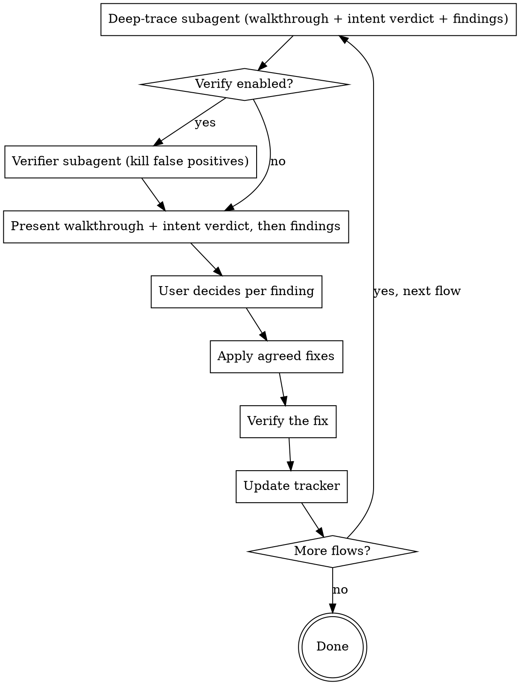

# pair-vibing Intent Alignment (v1.1) Implementation Plan

> **For agentic workers:** REQUIRED SUB-SKILL: Use superpowers:subagent-driven-development (recommended) or superpowers:executing-plans to implement this plan task-by-task. Steps use checkbox (`- [ ]`) syntax for tracking.

> **Executed 2026-07-02** on branch `build-intent-alignment` — all 8 tasks complete (Task 2 after two protocol redesigns; see the amendment notes). RED/GREEN evidence: `test-fixtures/intent-notes.md`.

**Goal:** Upgrade the pair-vibing skill so every per-flow review verifies the flow's actual behavior against user-blessed intent, proven by a planted intent-mismatch defect (P8) the 1.0 skill misses and the 1.1 skill catches.

**Architecture:** Intent is captured at the existing inventory sign-off gate, persisted as an `Intended:` line per flow in the tracker, and checked at the top of every per-flow review via a compact actual-behavior walkthrough + intent verdict from the deep-trace subagent. Divergences become ordinary findings with a new `intent` dimension and flow through the unchanged fix/accept/defer/not-real loop. TDD-for-skills: define P8 (unwritten, ask-gated user intent) → RED run (1.0 misses) → implement → GREEN run (1.1 catches, P1–P7 intact).

**Tech Stack:** Markdown + YAML frontmatter (Claude Code skill format). Test runs dispatch a general-purpose subagent via the Agent tool. Spec: `docs/superpowers/specs/2026-07-02-intent-alignment-design.md`.

## Global Constraints

- Fixture innocence: nothing under `test-fixtures/notes-app/` may mention planted defects, testing, fixtures, or deliberate breakage — it must read as a normal small app.
- Version lives ONLY in `plugin/.claude-plugin/plugin.json` (never in `marketplace.json`); this plan bumps it to exactly `1.1.0`.
- `SKILL.md` frontmatter `description` must stay under 1024 characters and parse as YAML.
- The new dimension key is exactly `intent`; existing keys `mechanics` / `edge` / `gaps` / `ux` are unchanged.
- Historical docs (`docs/superpowers/specs/2026-07-01-*`, `docs/superpowers/plans/2026-07-01-*`, `test-fixtures/baseline-notes.md`, `test-fixtures/with-skill-notes.md`) are NOT modified.
- All paths are relative to the repo root `C:\Users\liewj\Projects\pair-vibing`.

---

### Task 1: Define P8 — the intent-mismatch defect (no file plant)

> **Amended 2026-07-02 (executed):** originally this task planted "newest note first"
> into the fixture README (commit `20186c0`). The RED run caught it — a doc-stated
> behavior becomes the flow's goal at sign-off, and the 1.0 skill checks flows against
> stated goals. The plant was reverted (commit `3a4199d`; fixture verified byte-identical
> to its pre-plant state). P8 is now defined entirely in the test protocol: it is
> **unwritten user intent**, revealed by the simulated user only when asked.

**Files:**
- (none — the fixture is not modified)

**Interfaces:**
- Produces: the P8 ground truth every later task grades against — the simulated user's
  intended View-notes behavior is "newest note first" (revealed only if asked); the code
  shows insertion order (oldest first) via `server.js:15` (`notes.push(note)`),
  `server.js:10` (`res.json(notes)` as-is), `app.js:6-13` (render in received order).
  No document states the preference.

- [x] Complete — no further action. The fixture stays byte-identical to its v1.0 state.

---

### Task 2: RED run — prove the 1.0 skill misses P8

**Files:**
- Create: `test-fixtures/intent-notes.md`

**Interfaces:**
- Consumes: P8 as defined in Task 1 (unwritten user intent, ask-gated); the UNMODIFIED v1.0 skill at `plugin/skills/pair-vibing/`.
- Produces: `test-fixtures/intent-notes.md` with the P8 ground-truth table and the RED record; Task 8 appends the GREEN record to this same file.

- [ ] **Step 1: Dispatch the RED reviewer subagent**

Dispatch ONE general-purpose subagent (Agent tool) with exactly this prompt:

```
You are reviewing a project for a user, following a skill exactly.

1. Read C:\Users\liewj\Projects\pair-vibing\plugin\skills\pair-vibing\SKILL.md and every
   file in C:\Users\liewj\Projects\pair-vibing\plugin\skills\pair-vibing\references\.
2. Execute that skill against the target project at
   C:\Users\liewj\Projects\pair-vibing\test-fixtures\notes-app (its code and its README).
3. This is a non-interactive run — simulate the user as follows:
   - Adversarial verification: OFF.
   - Inventory sign-off: the user approves the discovered flows as-is (no additions,
     removals, or reordering). Presenting the inventory — including any per-flow goal
     fields — earns exactly "approved as-is" and nothing more. The user reveals
     behavioral preferences ONLY under this condition: the skill text you are executing
     contains an explicit instruction, as a distinct step, to ask the user to state,
     confirm, or correct each flow's INTENDED behavior. If that condition holds, you
     must (a) QUOTE the mandating skill line verbatim in your report at the sign-off
     point, naming its source file, and only then (b) the user answers: Add a note — as
     the README describes; Delete a note — as the README describes; View notes —
     "notes should show the newest note first." If you cannot quote such a line from
     the skill files, the user confirms the inventory silently and reveals nothing.
     The user never volunteers preferences unasked, anywhere in the run.
   - Every per-finding decision: defer (do NOT modify any project files).
   - Do NOT write any files anywhere (no tracker file) — include the full tracker
     content and all findings inline in your final report instead.
   - Do the analysis inline yourself instead of dispatching subagents.
4. Your final message: the complete review report — flow inventory, per-flow analysis,
   and every finding with severity, dimension, evidence (file:line), and recommendation.
```

- [ ] **Step 2: Grade the report (RED criterion)**

**Protocol validity check (before grading):** if the report shows the user revealed the
ordering preference, it must contain a verbatim quote of the skill line mandating the
intended-behavior question, with its source file. Verify the quote exists:
`grep -rF "<quoted text>" plugin/skills/pair-vibing/` — AND judge that the quoted line
actually instructs the agent to ask the user to state/confirm/correct intended behavior
(quoting the v1.0 sign-off line "add missing flows, remove anything that is not a real
user flow, and set a priority order" does NOT qualify — it asks nothing about behavior).
A missing, fabricated, misattributed, or non-qualifying quote makes the run INVALID
(protocol violation, not a skill capability) — re-dispatch the reviewer subagent once.
If the second run is also invalid, report BLOCKED with both runs' sign-off sections.

RED passes if and only if the report does **NOT** surface P8 — i.e., no finding that the rendered note order diverges from the user's wanted "newest first" ordering. (The 1.0 process has no step that elicits the user's intended behavior, so the preference never enters the run; it cannot flag a divergence from intent it never learns.)

Expected: P8 absent from the report.

**STOP condition:** if the report DOES flag the ordering divergence, the 1.0 skill already catches P8 and the gap this plan fixes is not demonstrated. STOP, do not proceed to Task 3 — report back to the controller with the run output so P8 can be redesigned. (First designed-in failure already occurred and was resolved: see the Task 1 amendment note.)

- [ ] **Step 3: Create `test-fixtures/intent-notes.md` with ground truth + RED record**

Create the file with this content, filling the bracketed RED section from the actual run (summarize which findings the run DID surface, then state the verdict):

```markdown
# Intent-Alignment Test Notes (P8)

Ground truth for the planted intent-mismatch defect and the RED/GREEN runs for the
pair-vibing v1.1 intent-alignment upgrade. P1–P7 are defined in `baseline-notes.md`.

## P8 — intent mismatch (unwritten user intent)

| ID | Flow | Severity | Dimension | Defect | Evidence |
|----|------|----------|-----------|--------|----------|
| P8 | View notes | major | intent | The user's intended behavior — "newest note first", revealed only when asked at sign-off — diverges from actual behavior: the app renders insertion order (oldest first). Nothing is broken and no document states the preference — a pure divergence from unwritten intent. | user-blessed intent (elicited at sign-off) vs `notes-app/server.js:15` (push → insertion order), `server.js:10` (returned as-is), `notes-app/app.js:6-13` (rendered in order) |

Severity rationale: a stated rule (ordering) is violated but the core outcome (notes
visible) is right → major, per the intent severity mapping in `review-rubric.md`.

Test protocol: the simulated user approves the inventory as-is and reveals the ordering
preference ONLY if the run quotes, verbatim with file attribution, a skill line that
explicitly mandates asking the user to confirm or correct each flow's intended behavior
(v1.0 has no such line; v1.1 does). The protocol is identical for RED and GREEN; only
the skill version differs.

## RED — v1.0 skill (pre-upgrade), 2026-07-02

Run: one subagent executing the unmodified v1.0 skill against the fixture,
ask-gated user intent, verification off, all decisions deferred, analysis inline.

Findings surfaced: [list the finding titles the run actually reported, one line each]

Verdict: **P8 NOT surfaced — RED confirmed.** The v1.0 process never asks for intended
behavior, so the user's ordering preference never entered the run.
```

- [ ] **Step 4: Commit**

```bash
git add test-fixtures/intent-notes.md
git commit -m "test: record RED — v1.0 skill misses planted intent mismatch P8"
```

---

### Task 3: Rubric — add the Intent match dimension

**Files:**
- Modify: `plugin/skills/pair-vibing/references/review-rubric.md` (full-file replacement)

**Interfaces:**
- Consumes: the `Intended:` tracker field name (defined in Task 5; the rubric references it by that exact name).
- Produces: dimension key `intent` and the intent severity mapping that Tasks 5, 6, and 8 rely on; dimension section numbering 1–5 with intent first.

- [ ] **Step 1: Replace the entire file content**

Replace the full content of `plugin/skills/pair-vibing/references/review-rubric.md` with:

```markdown
# Review Rubric

Apply all five dimensions to each flow. For every issue, record: **severity**
(blocker / major / minor), **evidence** (`file:line` or spec section), and a
**concrete recommendation**. No vague notes.

## 1. Intent match
Does the flow do what the user intended? Check actual behavior against the flow's
blessed `Intended:` line in the tracker (captured at inventory sign-off; precedence:
the user's statements > spec/PRD/docs > the agent-inferred goal).
- The outcome matches the intended goal — the user ends up where they meant to.
- Stated rules are honored: ordering, confirmations, limits, defaults, copy where specified.
- Every intended step is present; none silently skipped.
- No extra behavior the user didn't ask for (silent side effects, surprise navigation).

Severity for intent findings: core outcome wrong → **blocker**; a stated rule or step
violated but the core outcome right → **major**; cosmetic divergence from stated
intent → **minor**.

## 2. Mechanics & wiring
Does each step actually work and connect?
- Every button / link / action wired to a real handler (no stub, no-op, or placeholder).
- Navigation targets exist and land on the right screen/state.
- Data actually persists and reloads; forms submit and save.
- State updates propagate to the UI (no stale views).
- API/DB calls hit real endpoints; both success AND failure paths are handled.
- No hardcoded/mock data standing in for the real thing.

## 3. Edge & error states
What happens off the happy path?
- Empty state (no data yet).
- Loading / pending state.
- Invalid input / validation errors surfaced to the user.
- Server error, network failure, timeout.
- Permission-denied / unauthenticated / session-expired.
- Not-found (bad id, deleted resource).
- Concurrent or duplicate actions (double-submit, race).
- Boundary values (0, empty string, max length, very large lists).
- Offline / partial connectivity (if relevant).

## 4. Gaps & dead ends
Can the flow always complete?
- Unhandled branches / conditions.
- TODO / FIXME / commented-out logic in the path.
- Flows that start but have no completion.
- Orphaned screens (reachable but lead nowhere) or unreachable screens.
- Missing back / cancel / undo / retry.
- No exit from an error state.

## 5. UX friction & clarity
Does the flow feel right to a real user?
- Feedback after every action (success/failure is visible).
- Confirmation before destructive/irreversible actions.
- Step count reasonable (no needless friction).
- Labels/copy unambiguous; the user knows what happens next.
- Progress indication for multi-step or long operations.
- Consistent with patterns used elsewhere in the app.

## Severity guide
- **Blocker** — the flow cannot be completed, or it loses/corrupts data.
- **Major** — works on the happy path but breaks on a common edge, or is badly confusing.
- **Minor** — polish, clarity, or rare-edge improvement.

## Tracker dimension keys
When logging a finding to the tracker, use the short key for its dimension:
`intent` (Intent match), `mechanics` (Mechanics & wiring), `edge` (Edge & error states),
`gaps` (Gaps & dead ends), `ux` (UX friction & clarity).
```

- [ ] **Step 2: Verify only the intended sections changed**

Run: `git diff plugin/skills/pair-vibing/references/review-rubric.md`
Expected: intro says "five dimensions"; new `## 1. Intent match` section; old sections renumbered 2–5 with body text unchanged; Severity guide unchanged; dimension-keys line now includes `intent` first.

- [ ] **Step 3: Commit**

```bash
git add plugin/skills/pair-vibing/references/review-rubric.md
git commit -m "feat: add intent-match dimension to review rubric"
```

---

### Task 4: Flow discovery — bless intent at sign-off

**Files:**
- Modify: `plugin/skills/pair-vibing/references/flow-discovery.md` (the `## Merge & sign-off` section)

**Interfaces:**
- Produces: the intent-blessing procedure and precedence rule that SKILL.md Phase 1 (Task 6) points at.

- [ ] **Step 1: Replace the Merge & sign-off section**

In `plugin/skills/pair-vibing/references/flow-discovery.md`, replace:

```markdown
## Merge & sign-off
- Merge all subagent results; dedupe overlapping flows; combine partial traces.
- Present the merged inventory to the user. Ask them to: add missing flows, remove
  anything that is not a real user flow, and set a priority order.
- **Do not start Phase 2 until the user confirms the inventory.** This completeness
  gate guarantees no flow is silently skipped.
```

with:

```markdown
## Merge & sign-off (intent blessing)
- Merge all subagent results; dedupe overlapping flows; combine partial traces.
- Present the merged inventory to the user. Ask them to: add missing flows, remove
  anything that is not a real user flow, and set a priority order.
- **Bless intent per flow:** ask the user to confirm or correct each flow's goal and
  key steps as their INTENDED behavior — explicitly inviting rules the code cannot
  show (confirmations, ordering, defaults, where the user should land). Tell them:
  "This is the intent the review will verify each flow against." Intent precedence:
  the user's statements > spec/PRD/docs > the agent-inferred goal. If the user says
  "whatever it does today is fine" for a flow, adopt current behavior as its intent
  and log that under the flow's Decisions.
- **Do not start Phase 2 until the user confirms the inventory and per-flow intent.**
  This completeness gate guarantees no flow is silently skipped and every flow has a
  reference intent to verify against.
```

- [ ] **Step 2: Verify**

Run: `git diff plugin/skills/pair-vibing/references/flow-discovery.md`
Expected: only the Merge & sign-off section changed; the rest of the file (What counts as a user flow, Dispatch, What each subagent returns) untouched.

- [ ] **Step 3: Commit**

```bash
git add plugin/skills/pair-vibing/references/flow-discovery.md
git commit -m "feat: bless per-flow intent at inventory sign-off"
```

---

### Task 5: Tracker — persist blessed intent

**Files:**
- Modify: `plugin/skills/pair-vibing/references/tracker-template.md` (four edits)

**Interfaces:**
- Consumes: dimension key `intent` (Task 3).
- Produces: the `Intended:` field name that the rubric (Task 3) and SKILL.md (Task 6) reference; the example intent finding row.

- [ ] **Step 1: Add the Intended field to the per-flow header**

Replace:

```markdown
**Entry point:** `src/routes/signup.tsx:12`
**Goal:** New user creates an account and lands on the dashboard.
**Steps:** open form → validate → submit → create account → redirect.
```

with:

```markdown
**Entry point:** `src/routes/signup.tsx:12`
**Goal:** New user creates an account and lands on the dashboard.
**Intended:** validate inline, create the account, pass through the onboarding wizard
before the dashboard; duplicate emails rejected with a clear message (blessed at sign-off).
**Steps:** open form → validate → submit → create account → redirect.
```

- [ ] **Step 2: Add `intent` to the dimension keys line**

Replace:

```markdown
Dimension keys: `mechanics` / `edge` / `gaps` / `ux` (defined in the pair-vibing skill's
`references/review-rubric.md`).
```

with:

```markdown
Dimension keys: `intent` / `mechanics` / `edge` / `gaps` / `ux` (defined in the
pair-vibing skill's `references/review-rubric.md`).
```

- [ ] **Step 3: Add an example intent finding row**

Replace:

```markdown
| 3 | minor | ux | No loading state on submit | `signup.tsx:44` | Disable button + spinner during submit | deferred |
```

with:

```markdown
| 3 | minor | ux | No loading state on submit | `signup.tsx:44` | Disable button + spinner during submit | deferred |
| 4 | major | intent | Redirects to /home after signup; user intended onboarding wizard first | `signup.tsx:61` | Redirect to `/onboarding` | fixed |
```

- [ ] **Step 4: Add the matching Changes-made entry**

Replace:

```markdown
### Changes made
- Finding 1: wired the submit button to `createUser()` — `signup.tsx:40`
- Finding 2: surfaced the API 409 as an inline field error — `signup.tsx:55`, `api/client.ts:88`
```

with:

```markdown
### Changes made
- Finding 1: wired the submit button to `createUser()` — `signup.tsx:40`
- Finding 2: surfaced the API 409 as an inline field error — `signup.tsx:55`, `api/client.ts:88`
- Finding 4: signup now redirects to the onboarding wizard — `signup.tsx:61`
```

- [ ] **Step 5: Verify internal consistency**

Read the modified file end to end. Expected: the example flow's `Intended:` line names the onboarding wizard, matching finding 4; findings 1, 2, 4 are `fixed` and appear under Changes made; finding 3 is `deferred` and does not; the `done` definition ("no finding left `open`") still holds for the example.

- [ ] **Step 6: Commit**

```bash
git add plugin/skills/pair-vibing/references/tracker-template.md
git commit -m "feat: persist blessed intent in tracker (Intended field, intent key)"
```

---

### Task 6: SKILL.md — walkthrough-first review with intent verdict

**Files:**
- Modify: `plugin/skills/pair-vibing/SKILL.md` (eight edits)

**Interfaces:**
- Consumes: `Intended:` field (Task 5), intent-blessing procedure (Task 4), `intent` dimension + severity mapping (Task 3).
- Produces: the deep-trace three-part return contract (walkthrough / intent verdict / findings) that Task 8's GREEN grading checks for.

- [ ] **Step 1: Update the frontmatter description**

Replace:

```yaml
description: Use when reviewing or refining a project's user flows one at a time, auditing a fast or vibe-coded app for broken mechanics, missing edge cases, dead-end flows, or rough UX, or when the user asks to "pair vibe", "vibe check" flows, or meticulously verify each user flow works end to end. Works on built code or a spec.
```

with:

```yaml
description: Use when reviewing or refining a project's user flows one at a time, verifying each flow does what the user intended and asked for, or auditing a fast or vibe-coded app for broken mechanics, missing edge cases, dead-end flows, or rough UX. Trigger when the user asks to "pair vibe", "vibe check" flows, check that flows match what they wanted or meant, or meticulously verify each user flow works end to end. Works on built code or a spec.
```

- [ ] **Step 2: Update the Overview and core principle**

Replace:

```markdown
Fast-built ("vibe-coded") projects pile up code that no one ever walked through
flow by flow: buttons that call nothing, error states that don't exist, flows that
start but can't finish. **Pair vibing** pairs you with the user to review the
project's user flows **one at a time**, meticulously, and fix what's broken as you go.

Core principle: **one flow at a time, evidence over hand-waving, no fix without the user's go-ahead.**
```

with:

```markdown
Fast-built ("vibe-coded") projects pile up code that no one ever walked through
flow by flow: buttons that call nothing, error states that don't exist, flows that
start but can't finish — and flows that run flawlessly yet do something the user
never asked for. **Pair vibing** pairs you with the user to review the project's
user flows **one at a time**, meticulously, verifying each flow both works and does
what the user intended, and fixing what's off as you go.

Core principle: **one flow at a time, verified against what the user intended,
evidence over hand-waving, no fix without the user's go-ahead.**
```

- [ ] **Step 3: Add the intent bullet to When to Use**

Replace:

```markdown
- You need to confirm mechanics work, edges are handled, and nothing dead-ends.
```

with:

```markdown
- You need to confirm mechanics work, edges are handled, and nothing dead-ends.
- You want to confirm what was built matches what was asked for — not just that it runs.
```

- [ ] **Step 4: Add legacy-tracker re-blessing to Phase 0**

Replace:

```markdown
3. Look for `pair-vibing/flows.md`. If it exists, summarize its status and ask where to
   resume. If not, go to discovery.
```

with:

```markdown
3. Look for `pair-vibing/flows.md`. If it exists, summarize its status and ask where to
   resume; if it predates intent blessing (no `Intended:` lines), offer to bless intent
   for the remaining flows before continuing. If it does not exist, go to discovery.
```

- [ ] **Step 5: Add intent blessing to Phase 1**

Replace:

```markdown
**Present the merged inventory to the user for sign-off** — they add, remove, and
reprioritize. This is the completeness gate: the user confirms the full set BEFORE any
refinement. Then write the inventory to `pair-vibing/flows.md` with every status `pending`
(use `references/tracker-template.md`).
```

with:

```markdown
**Present the merged inventory to the user for sign-off** — they add, remove, and
reprioritize, and **bless each flow's intent**: confirm or correct its goal and key
steps as the intended behavior (see `references/flow-discovery.md`). This is the
completeness gate: the user confirms the full set AND per-flow intent BEFORE any
refinement. Then write the inventory to `pair-vibing/flows.md` with every status
`pending` and an `Intended:` line per flow (use `references/tracker-template.md`).
```

- [ ] **Step 6: Update the Phase 2 loop diagram and prose**

Replace the entire ```dot code block with:



Then replace the paragraph after the diagram:

```markdown
The deep-trace subagent scores the single flow against the rubric in
`references/review-rubric.md` and returns findings with severity + evidence
(`file:line`) + a recommendation. The user decides each finding: fix / accept / defer /
not-real. Apply only the agreed fixes, verify them, then update the tracker.
Do NOT batch flows — one flow, full attention.
```

with:

```markdown
The deep-trace subagent returns three parts for the single flow: (1) a **walkthrough**
— what the flow actually does today, 3–6 numbered steps with `file:line` evidence
(spec sections on spec-only projects); (2) an **intent verdict** — matches or diverges
from the flow's `Intended:` line, naming each divergence; (3) **findings** scored
against the rubric in `references/review-rubric.md`, each with severity + evidence +
a recommendation — every intent divergence appears as a finding with dimension
`intent`. Present the walkthrough and intent verdict FIRST, every flow, even when
intent matches; then the findings. The user decides each finding: fix / accept /
defer / not-real. If the user prefers the built behavior over their stated intent,
resolve that finding `accepted`, update the flow's `Intended:` line, and log the
change under Decisions. Apply only the agreed fixes, verify them, then update the
tracker. Do NOT batch flows — one flow, full attention.
```

- [ ] **Step 7: Add the intent entries to Common mistakes and Red flags**

Replace:

```markdown
- Skipping the completeness gate — refining flows before the user confirmed the inventory.
```

with:

```markdown
- Skipping the completeness gate — refining flows before the user confirmed the inventory.
- Skipping the intent check — hunting defects in a flow whose behavior the user never confirmed.
```

And replace:

```markdown
- "I'll just review all the flows together." → One at a time.
```

with:

```markdown
- "I'll just review all the flows together." → One at a time.
- "The flow works, moving on." → Works ≠ what the user wanted. Check the intent verdict first.
```

- [ ] **Step 8: Verify frontmatter and length**

Run: `python -c "import re; t=open('plugin/skills/pair-vibing/SKILL.md',encoding='utf-8').read(); m=re.match(r'^---\n(.*?)\n---\n', t, re.S); assert m, 'frontmatter missing'; d=re.search(r'description: (.*)', m.group(1)).group(1); print('description chars:', len(d)); assert len(d) < 1024"`
Expected: prints a count under 1024, no assertion error.

- [ ] **Step 9: Commit**

```bash
git add plugin/skills/pair-vibing/SKILL.md
git commit -m "feat: walkthrough-first per-flow review with intent verdict"
```

---

### Task 7: Manifests + top-level README reframe, version 1.1.0

**Files:**
- Modify: `plugin/.claude-plugin/plugin.json` (description, version)
- Modify: `.claude-plugin/marketplace.json` (description)
- Modify: `README.md` (intro, problem, what-it-does)

**Interfaces:**
- Consumes: the five-dimension rubric framing (Task 3).
- Produces: v1.1.0; the public descriptions Task 8's final consistency check greps.

- [ ] **Step 1: Update plugin.json**

Replace:

```json
  "description": "Pairs you with the agent to review a project's user flows one at a time — mechanics, edge cases, dead ends, and UX — and fix them as you go.",
  "version": "1.0.0",
```

with:

```json
  "description": "Pairs you with the agent to review a project's user flows one at a time — verifying each flow matches what you intended, plus mechanics, edge cases, dead ends, and UX — and fixing them as you go.",
  "version": "1.1.0",
```

- [ ] **Step 2: Update marketplace.json's plugin description to the identical string**

Replace:

```json
      "description": "Pairs you with the agent to review a project's user flows one at a time — mechanics, edge cases, dead ends, and UX — and fix them as you go.",
```

with:

```json
      "description": "Pairs you with the agent to review a project's user flows one at a time — verifying each flow matches what you intended, plus mechanics, edge cases, dead ends, and UX — and fixing them as you go.",
```

(Do NOT add a version field to marketplace.json.)

- [ ] **Step 3: Update README.md intro**

Replace:

```markdown
A [Claude Code](https://claude.com/claude-code) skill that pairs you with the agent to
review a project's **user flows one at a time** — catching the broken mechanics, missing
edge cases, dead-end flows, and rough UX that slip through when a project is built fast.
```

with:

```markdown
A [Claude Code](https://claude.com/claude-code) skill that pairs you with the agent to
review a project's **user flows one at a time** — verifying each flow does what you
intended, and catching the broken mechanics, missing edge cases, dead-end flows, and
rough UX that slip through when a project is built fast.
```

- [ ] **Step 4: Update README.md problem statement**

Replace:

```markdown
handled. Buttons that call nothing, error states that don't exist, flows that start but can't
finish. It looks done; it isn't.
```

with:

```markdown
handled. Buttons that call nothing, error states that don't exist, flows that start but can't
finish — and flows that run flawlessly yet quietly do something you never asked for. It looks
done; it isn't.
```

- [ ] **Step 5: Update README.md what-it-does list**

Replace:

```markdown
1. **Discover** every user flow (reads the code if present, otherwise the spec/PRD/docs) and
   presents the inventory for your sign-off — the *completeness gate*, so nothing is silently
   skipped.
2. **Review** each flow, one at a time, against a four-dimension rubric:
   - **Mechanics & wiring** — does each step actually work and connect?
```

with:

```markdown
1. **Discover** every user flow (reads the code if present, otherwise the spec/PRD/docs) and
   presents the inventory for your sign-off — the *completeness gate*, so nothing is silently
   skipped — where you also bless each flow's **intended behavior**.
2. **Review** each flow, one at a time — opening with a walkthrough of what the flow
   *actually does* and a verdict against your intent — scored on a five-dimension rubric:
   - **Intent match** — does the flow do what you intended and asked for?
   - **Mechanics & wiring** — does each step actually work and connect?
```

- [ ] **Step 6: Update README.md repo-layout comment**

Replace:

```markdown
        review-rubric.md    the four-dimension rubric
```

with:

```markdown
        review-rubric.md    the five-dimension rubric (intent first)
```

- [ ] **Step 7: Verify**

Run: `python -c "import json; p=json.load(open('plugin/.claude-plugin/plugin.json',encoding='utf-8')); m=json.load(open('.claude-plugin/marketplace.json',encoding='utf-8')); assert p['version']=='1.1.0'; assert 'version' not in m['plugins'][0]; assert p['description']==m['plugins'][0]['description']; print('manifests OK')"`
Expected: `manifests OK`

- [ ] **Step 8: Commit**

```bash
git add plugin/.claude-plugin/plugin.json .claude-plugin/marketplace.json README.md
git commit -m "feat: reframe descriptions around intent; bump plugin to 1.1.0"
```

---

### Task 8: GREEN run — prove v1.1 catches P8 with P1–P7 intact

**Files:**
- Modify: `test-fixtures/intent-notes.md` (append GREEN record)
- Modify: `README.md` (How-it-was-built paragraph)

**Interfaces:**
- Consumes: the v1.1 skill (Tasks 3–6), P8 (Task 1), `test-fixtures/intent-notes.md` (Task 2).
- Produces: the GREEN evidence closing the TDD cycle.

- [ ] **Step 1: Dispatch the GREEN reviewer subagent**

Dispatch ONE general-purpose subagent with the IDENTICAL prompt from Task 2 Step 1 (copy it verbatim — the skill files on disk are now v1.1, which is the only difference).

- [ ] **Step 2: Grade the report (GREEN criteria — all four MUST hold)**

1. **Walkthrough + intent verdict present for each of the 3 flows** (Add / Delete / View), walkthroughs as numbered steps with `file:line` evidence.
2. **P8 surfaced** as a finding with dimension `intent`: the rendered note order (insertion order, oldest first) diverges from the user's blessed "newest note first" intent — elicited at sign-off — citing `app.js`/`server.js` evidence. (No README citation for the intent: the README is silent on ordering.)
3. **P1–P7 all still surfaced**, each with `file:line` evidence:
   1. Add note: `index.html:7` calls `addNote()` but `app.js` defines `createNote()` — blocker, mechanics.
   2. Add note: no empty-title validation — major, edge (`app.js` createNote / `server.js` POST).
   3. Add note: input not cleared / no success feedback — minor, ux (`app.js`).
   4. Delete note: `app.js` calls `DELETE /notes/:id` but `server.js` has no such route (`server.js` TODO comment) — blocker, gaps/mechanics.
   5. Delete note: no confirmation before delete — major, ux (`app.js` deleteNote).
   6. Any flow: no fetch error handling — major, edge (`app.js`).
   7. View notes: no empty-state message — minor, ux.
4. **A 3-flow inventory** with per-flow blessed intent reflected — including the elicited "newest note first" for View notes.
5. **The ask-gate opened legitimately:** the report quotes, verbatim with file attribution, the v1.1 skill line mandating the intent question (the "Bless intent per flow: ask the user to confirm or correct…" instruction in `references/flow-discovery.md`, or SKILL.md Phase 1's blessing line), and `grep -rF` confirms the quote exists in `plugin/skills/pair-vibing/`.

**STOP condition:** if any of criteria 1–4 fails (or criterion 5's quote is missing/fabricated), do NOT record GREEN. Diagnose which skill file under-instructs (usually SKILL.md Phase 2 or the rubric's intent section), fix it, commit the fix (`fix: <what>`), and re-run this task's Step 1. Repeat until all four criteria hold.

- [ ] **Step 3: Append the GREEN record to `test-fixtures/intent-notes.md`**

Append (filling the bracketed line from the actual run):

```markdown
## GREEN — v1.1 skill, 2026-07-02

Run: identical protocol to RED, against the upgraded v1.1 skill.

Result: walkthrough + intent verdict presented for all 3 flows; the sign-off elicited
the user's "newest note first" intent; **P8 surfaced as an `intent` finding** (rendered
order diverges from blessed intent) with evidence; P1–P7 all still surfaced with
`file:line` evidence. [note any extra findings or deviations]

Verdict: **GREEN — the intent-alignment upgrade catches what v1.0 could not, with no
regression on the original seven planted defects.**
```

- [ ] **Step 4: Add the How-it-was-built note to README.md**

Replace:

```markdown
caught all 7 — organized into a per-flow inventory with severity and `file:line` evidence. See
`test-fixtures/baseline-notes.md` (RED) and `test-fixtures/with-skill-notes.md` (GREEN).
```

with:

```markdown
caught all 7 — organized into a per-flow inventory with severity and `file:line` evidence. See
`test-fixtures/baseline-notes.md` (RED) and `test-fixtures/with-skill-notes.md` (GREEN).

The v1.1 intent-alignment upgrade was built the same way: an 8th defect was defined
that works perfectly and appears in no document — the simulated user wanted notes
newest-first but only says so when asked. The 1.0 skill, which never asks, missed it;
the 1.1 skill elicits intent at sign-off and catches it as an `intent` finding. See
`test-fixtures/intent-notes.md`.
```

- [ ] **Step 5: Final consistency check**

Run: `grep -rn "four-dimension\|four dimensions" README.md plugin/skills/pair-vibing/` — Expected: no matches.
Run: `grep -rln "intent" plugin/skills/pair-vibing/references/review-rubric.md plugin/skills/pair-vibing/references/tracker-template.md plugin/skills/pair-vibing/SKILL.md` — Expected: all three files listed.
Run: `grep -rn "planted\|fixture\|deliberately" test-fixtures/notes-app/` — Expected: only the two pre-existing marker comments (`app.js:17` "Planted wiring bug", `server.js:19` "planted gap"), nothing new added by this plan.

- [ ] **Step 6: Commit**

```bash
git add test-fixtures/intent-notes.md README.md
git commit -m "test: record GREEN — v1.1 catches P8 as intent finding, P1-P7 intact"
```
