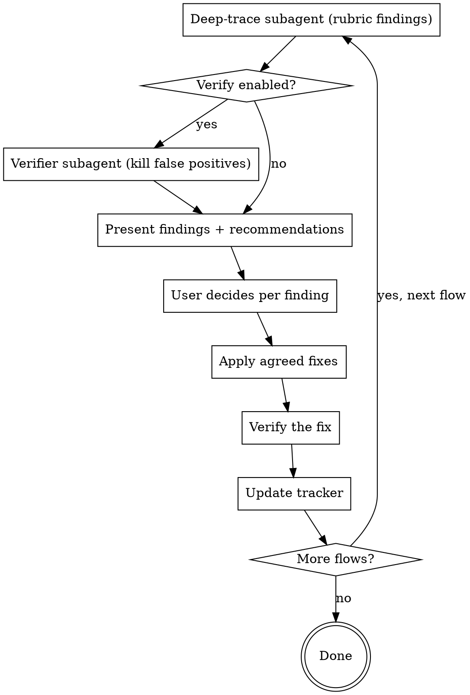

# Pair Vibing

## Overview

Fast-built ("vibe-coded") projects pile up code that no one ever walked through
flow by flow: buttons that call nothing, error states that don't exist, flows that
start but can't finish. **Pair vibing** pairs you with the user to review the
project's user flows **one at a time**, meticulously, and fix what's broken as you go.

Core principle: **one flow at a time, evidence over hand-waving, no fix without the user's go-ahead.**

## When to Use

- The user says "pair vibe", "vibe check", "review the flows", or "check each user flow".
- A project was generated quickly and needs a careful walk-through of every flow.
- You need to confirm mechanics work, edges are handled, and nothing dead-ends.
- Works whether the project has code (read the code) or is only a spec (read the docs).

When NOT to use: broad refactoring, performance tuning, or writing a test suite —
this is about user-flow correctness and completeness, not general code quality.

## The Process

**Phase 0 — Orient & resume**
1. Detect what the project has: code, spec/docs, or both.
2. Ask the user whether to enable **adversarial verification** of findings (see Verification below).
3. Look for `pair-vibing/flows.md`. If it exists, summarize its status and ask where to
   resume. If not, go to discovery.

**Phase 1 — Discover flows (fan out)**
Dispatch parallel subagents to map the project by area, then merge into one inventory.
REQUIRED: see `references/flow-discovery.md` for how to dispatch and what each returns.
**Present the merged inventory to the user for sign-off** — they add, remove, and
reprioritize. This is the completeness gate: the user confirms the full set BEFORE any
refinement. Then write the inventory to `pair-vibing/flows.md` with every status `pending`
(use `references/tracker-template.md`).

**Phase 2 — Per-flow refinement loop**
For each flow, in the user's chosen order:

The deep-trace subagent scores the single flow against the rubric in
`references/review-rubric.md` and returns findings with severity + evidence
(`file:line`) + a recommendation. The user decides each finding: fix / accept / defer /
not-real. Apply only the agreed fixes, verify them, then update the tracker.
Do NOT batch flows — one flow, full attention.

**Phase 3 — Wrap**
Summarize flows reviewed / findings fixed / deferred / still pending. The tracker persists,
so a later session resumes from Phase 0.

## Verification option

In Phase 0, ask the user: "Enable adversarial verification of findings? It runs a second
subagent that tries to refute each finding — kills false positives, but is slower."
Respect their choice for the whole session. Only run the verifier subagent (Phase 2) if enabled.

## Subagent orchestration

- Discovery and per-flow deep-trace run as dispatched subagents (Task/Agent tool; or a
  workflow/orchestration tool for many flows, if your environment provides one).
- **Degrade gracefully:** for a tiny project, or when subagents aren't available, do the
  analysis inline. The process (inventory → per-flow rubric → discuss → fix → track) is unchanged.

## Common mistakes

- Skipping the completeness gate — refining flows before the user confirmed the inventory.
- Batching flows — reviewing several at once instead of one at a time loses depth.
- Fixing without the user's go-ahead — every change is agreed per finding first.
- Vague findings — every finding needs concrete evidence (`file:line`) and a recommendation.
- Forgetting to update the tracker — the next session then can't resume.

## Red flags — STOP

- "I'll just review all the flows together." → One at a time.
- "This finding is probably an issue" (no evidence). → Trace it, cite `file:line`, or drop it.
- "I'll fix these obvious ones without asking." → The user decides every fix.
- "The inventory looks complete, I'll start" (no user sign-off). → Get the completeness gate first.
